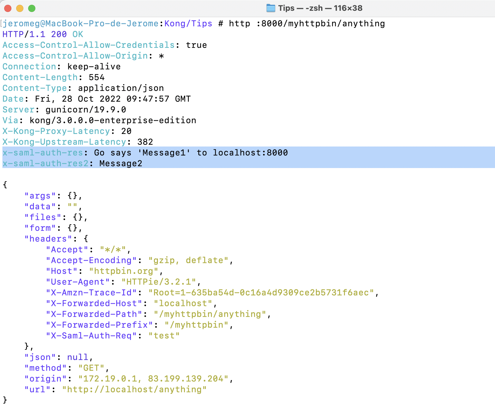

# custom-plugins
Init repository for setting up custom plugin in Go

The purpose of this plugn is to:
- Add a header on the request (before be sent to the backend): x-saml-auth-req
- Add a header on the response (sent to the API Consumer): x-saml-auth-res

See example below with the Endpoint http://httpbin.org/anything and the saml-auth plugin enabled


## Prepare Kong environment : Docker network,  PostgreSQL (start & prepare PostgreSQL) and License
1) Create a custom Docker network to allow the containers to discover and communicate with each other
``` 
docker network create kong-net
``` 
2) Start a PostgreSQL container
```
docker run -d --name kong-database-saml \
  --network=kong-net \
  -p 5432:5432 \
  -e "POSTGRES_USER=kong" \
  -e "POSTGRES_DB=kong" \
  -e "POSTGRES_PASSWORD=kongpass" \
  postgres:9.6
```
3) Prepare the Kong database
```
docker run --rm --network=kong-net \
  -e "KONG_DATABASE=postgres" \
  -e "KONG_PG_HOST=kong-database-saml" \
  -e "KONG_PG_PASSWORD=kongpass" \
  -e "KONG_PASSWORD=test" \
 kong/kong-gateway:2.8.1.1-alpine kong migrations bootstrap
```
4) Export the Kong EE licence

Note: The following license is only an example. You must use the following format, but provide your own content.
```
 export KONG_LICENSE_DATA='{"license":{"payload":....","version":"1"}}'

```

## Build Kong gateway image with Go custom plugin
Build Kong Gateway from project root with name as richemont/kong-gateway-saml (note the trailing .)
```
docker build -t richemont/kong-gateway-saml .
```
## Run Kong gateway container with Go custom plugin
Start Kong Gateway
```
./start-kong.sh
```

## Environment
Once the environment is up and running, both Kong Manager and the Admin API can be accessed on localhost for testing

Manager: http://localhost:8002

Admin API: http://localhost:8001

Proxy: http://localhost:8000

Kong Manager with the saml-auth Go custom plugin


